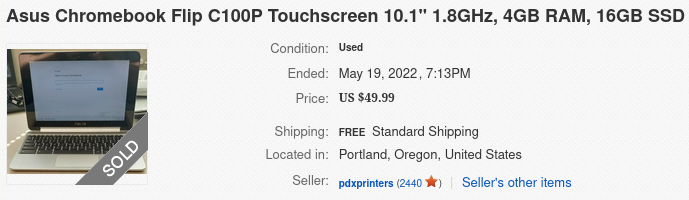

A rogues gallery of assorted "stuff" that I would like to have.

## computer hardware

### asus chromebook flip c100pa

This Chromebook was my first ever laptop device and holds a special place in my heart for its aluminum shell and convertible form factor. Despite being many years behind in processing speed and sporting Chrome OS as its operating system of choice, I would actively use this device in cases where travelling light is highly important. Unfortunately my Chromebook had its screen damaged and is missing its charger, so I am unable to upgrade to an un-Googled operating system. Finding a new charger is not a problem despite the proprietary shape; [$10 - $20 dollars on eBay](https://www.ebay.com/sch/i.html?_nkw=asus+chromebook+flip+charger+c100pa){:target="_blank"} can buy an off-brand charger, but finding a replacement for the screen is definitely an issue. Somehow genuine screens are more expensive than used Chromebooks themselves.

